# Hope in the dark

A custom modpack for HoloNews server.

# Installation

1. Head to the release page on [GitHub](https://github.com/oOBoomberOo/hope-in-the-dark/releases) 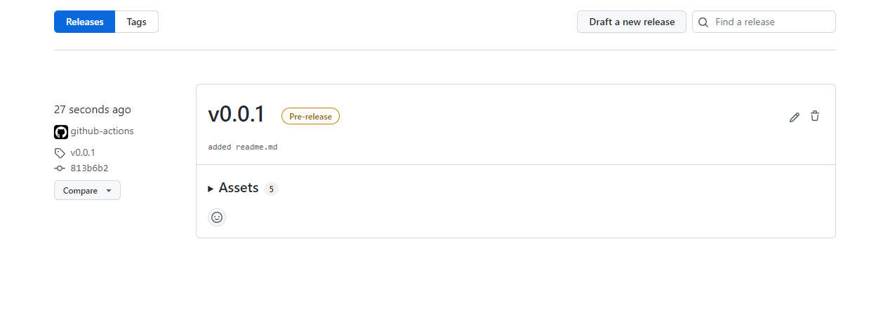
2. Expand the Assets panel to see the modpack files. 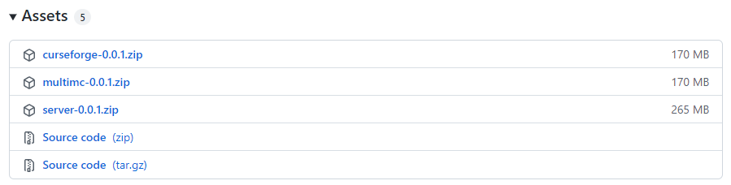
3. Download either [CurseForge](#curseforge) or [MultiMC](#multimc) instance and proceed this instruction accordingly.

## Curseforge

4. Click the "Create Custom Profile" button located in the top-right corner of the CurseForge launcher.  
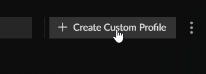
5. Select the "import" option.  
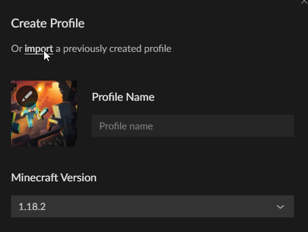
6. Select the curseforge instance from the file picker.  
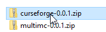
7. A new modpack instance will be created in your menu.  
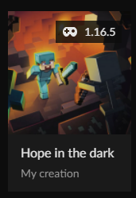

> **NOTE**: You may notice that the modpack contained no mods. This is due to an odd format in which the modpack is packaged. **The mods are included** and will show up after you launch the game for the first time.

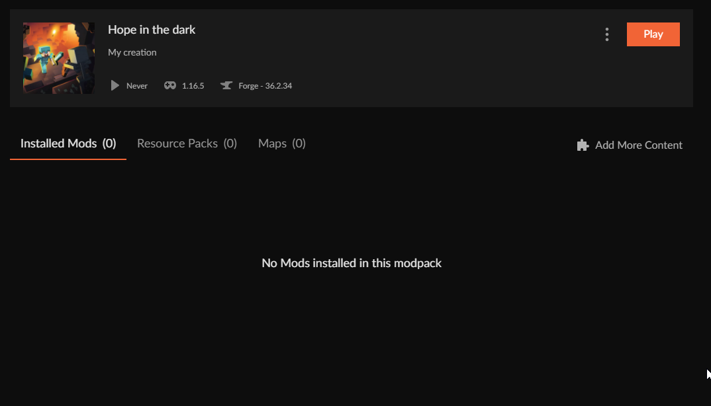

## MultiMC

4. Click the "Add instance" button.  
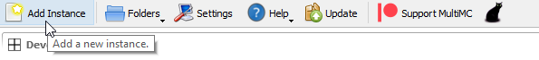
5. Select the "Import from zip" option.  
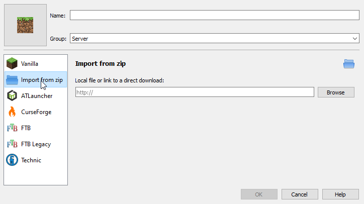
6. Select the multimc instance from the file picker.  
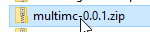
7. Click "OK" to proceed with the import.
8. A new MultiMC instance will be created like below.  
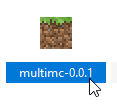
